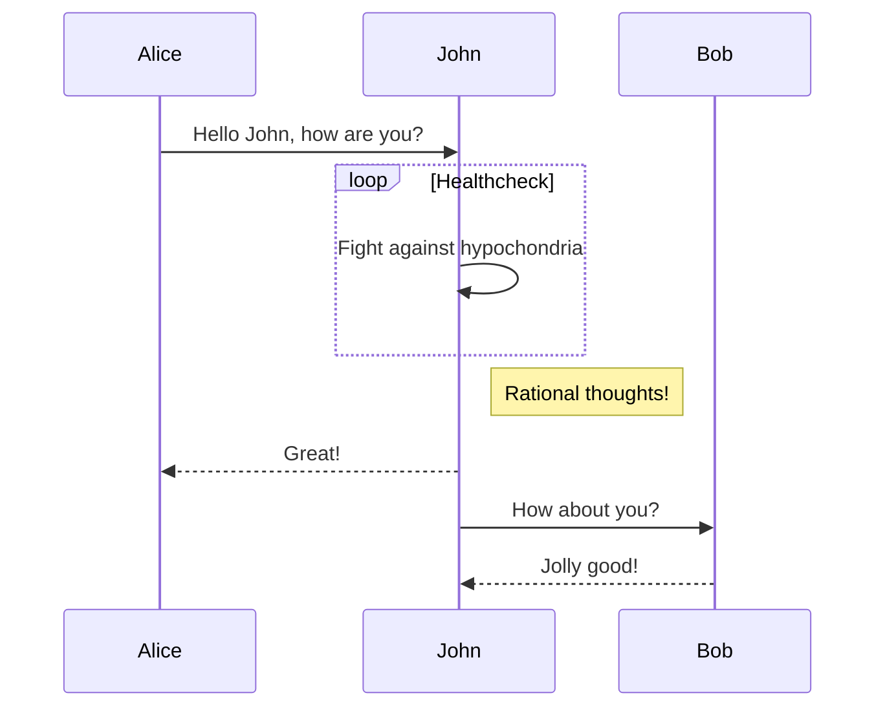
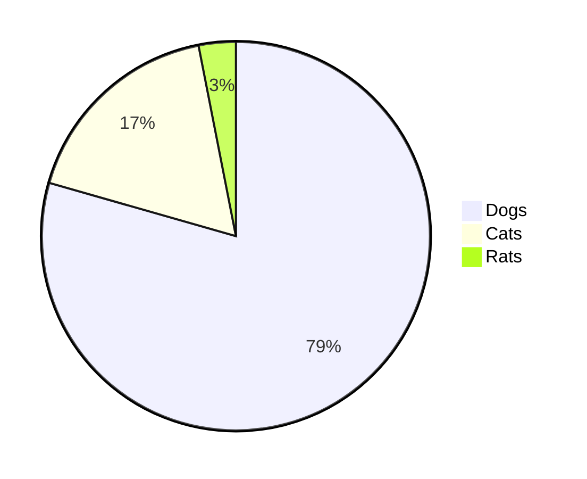

# pdfmk

**P**rint **D**ocument **F**rom **M**ar**k**down / **PDF** **M**a**k**er

Make PDF from markdown!

Here is an [input](https://raw.githubusercontent.com/haxibami/pdfmk/master/sample/input.md) and an [output](https://raw.githubusercontent.com/haxibami/pdfmk/master/sample/output.pdf).

## Supported Features

- GFM (GitHub Flavoured Markdown)
- GitHub emoji
- math rendering (KaTeX)
- CJK ruby
- TOC generation
- [Mermaid](https://mermaid-js.github.io) diagrams
- syntax highlighting
- in-document link

## Installation

### System Requirements

**IMPORTANT**

As of now, pdfmk uses Chrome (headless mode) to print pdfs. Make sure you have installed one on your system. The executable path should be detected automatically.

<details>
<summary>Short note on chrome / chromium:</summary>

By default, [deno-puppeteer](https://github.com/lucacasonato/deno-puppeteer) ships with an [old version](https://github.com/lucacasonato/deno-puppeteer/blob/4d744407adbc23e66f6896ed7f1dc30b31725621/vendor/puppeteer-core/puppeteer/revisions.js) of standalone chromium binary, which unfortunately crashes in some environments. To avoid this, we use system chrome binary, assuming you have one on your computer.

</details>

### one-shot try:

```bash
deno run -A --no-check https://github.com/haxibami/pdfmk/raw/main/cli.ts [args]
```

### system install

```bash
deno install -Af --no-check --name=pdfmk https://github.com/haxibami/pdfmk/raw/main/cli.ts
# DON'T FORGET ADDING DENO PATH INTO YOUR $PATH!
```

## Usage

```bash
> pdfmk --help

pdfmk v0.0.1 - Make PDF from markdown

Usage:
    pdfmk input output [options]
    pdfmk input [options] (output defaults to <input>.pdf)
Options:
    -h, --help
            Show this help.
    -s, --style
            CSS style file. Default style is in "https://github.com/haxibami/pdfmk/styles.ts".
    -f, --format <format>
            Paper format. Defaults to "a4".
            Available values: a0, a1, a2, a3, a4, a5, letter, legal, tabloid, ledger.
    -z, --scale <scale>
            Scale factor. Defaults to 1. 0.1 to 2.
    -m, --margin <margin>
            Page margin. Defaults to 20mm.
    -p, --prismTheme <theme>
            Prism theme. Defaults to "default".
            44 themes are available.
            See "https://prismjs.com/themes" &
            "https://github.com/PrismJS/prism-themes" for all values.
    -d, --mermaidTheme <theme>
            Mermaid theme. Defaults to "default".
            Available values: base, default, forest, dark, neutral.
    --channel <channel>
            Chromium channel. Defaults to "chrome".
            Available values: "chrome", "chrome-beta", "chrome-canary", "chrome-dev".
```

## Available Syntax

See the sample [input](https://raw.githubusercontent.com/haxibami/pdfmk/master/sample/input.md) and [output](https://raw.githubusercontent.com/haxibami/pdfmk/master/sample/output.pdf) for full example & display.

### Ruby syntax

As per specification in [remark-jaruby](https://haxibami.net/remark-jaruby).

Define ruby:

```md
{聖剣}^(エクスカリバー)
```

### Math rendering

```md
> $$
> ( \sum_{k=1}^{n} a_k b_k )^2 \leq ( \sum_{k=1}^{n} {a_k}^2 )( \sum_{k=1}^{n} {b_k}^2 )
> $$
```

```md
> "$e^{i\pi} + 1 = 0$ "; Euler said.
```

### Mermaid diagrams

````md



````
