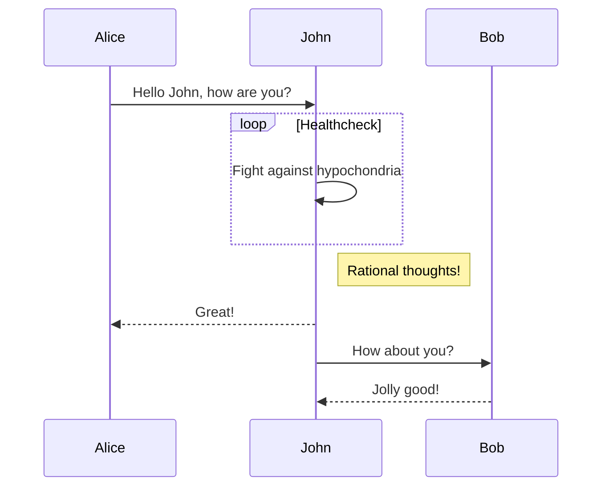
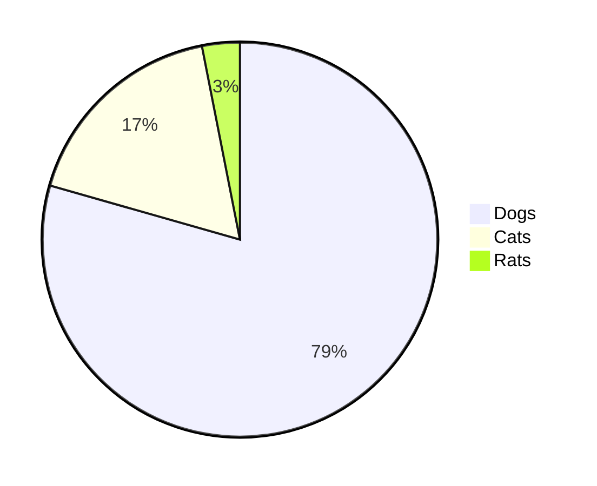

# pdfmk sample

**P**rint **D**ocument **F**rom **M**ar**k**down / **PDF** **M**a**k**er

Make PDF from markdown!

## TOC

## Examples

### GFM

```md
| Create  | Table    |
| ------- | -------- |
| Like    | This     |
| And add | Elements |

Below is a raw URL:

https://www.haxibami.net

- See!
  - This is a list, and...[^1]

[^1]: You can add footnote!
```

| Create  | Table    |
| ------- | -------- |
| Like    | This     |
| And add | Elements |

Below is a raw URL:

https://www.haxibami.net

- See!
  - This is a list, and...[^1]

[^1]: You can add footnote!

### GitHub emoji

```md
> :sunglasses: :whale: :sheep:
```

> :sunglasses: :whale: :sheep:

### Math rendering

```md
> $$
> ( \sum_{k=1}^{n} a_k b_k )^2 \leq ( \sum_{k=1}^{n} {a_k}^2 )( \sum_{k=1}^{n} {b_k}^2 )
> $$
```

```md
> "$e^{i\pi} + 1 = 0$ "; Euler said.
```

> $$
> ( \sum_{k=1}^{n} a_k b_k )^2 \leq ( \sum_{k=1}^{n} {a_k}^2 )( \sum_{k=1}^{n} {b_k}^2 )
> $$

> "$e^{i\pi} + 1$ equals to $0$ "; Leonhard Euler said.

### CJK Ruby

Define ruby:

```md
> {聖剣}^(エクスカリバー)
```

And the output:

> {聖剣}^(エクスカリバー)

### TOC generation

Use `--tocHeading` option to specify heading.

```md
...

## TOC

...
```

generates [this section](#toc)

### Mermaid diagrams

````md



````


### syntax highlighting & code quotes

pdfmk runs on...

:x: `node`

:o: `deno`

```c
#include <stdio.h>
#include <stdlib.h>

int main() {
  int n;
  scanf("%d", &n);
  int all[n][3];
  for (int i = 0; i < n; i++) {
    scanf("%d", &all[i][0]);
    scanf("%d", &all[i][1]);
    scanf("%d", &all[i][2]);
  }

  int flag = 0;

  for (int i = 0; i < n; i++) {
    int t;
    int x;
    int y;
    if (i == 0) {
      t = all[i][0];
      x = all[i][1];
      y = all[i][2];
    } else {
      t = all[i][0] - all[i - 1][0];
      x = abs(all[i][1] - all[i - 1][1]);
      y = abs(all[i][2] - all[i - 1][2]);
    };
    if (t - x - y < 0 || (t - x - y) % 2 != 0) {
      flag = 1;
      break;
    }
  }

  if (flag == 0) {
    printf("Yes\n");
  } else {
    printf("No\n");
  }
}
```

### in-document link

Since each section has its own id & link, you can easily fly back to [top](#pdfmk-sample)
